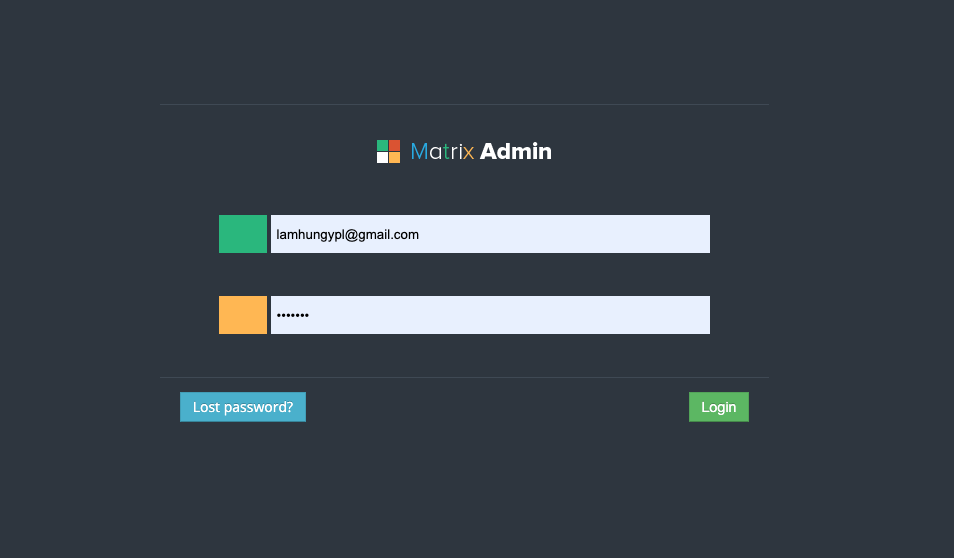

# Online Store

Open source and web final project.

## Tools

The website is built and developed using the [Laravel](https://laravel.com/) and [MySQL]

used MAMP solution: Laravel 5.7, PHP 7.4 , MySQL 5.7

## Run project locally

### Step 1: Clone project

```sh
git clone https://github.com/lamhungypl/eshopping.git your-folder-name
cd your-folder-name
```

## Step 2: Install dependencies

```sh
composer install
```

## Step 3: Setup database

Setup your data base username, password, dbname, port. See [`.env.example`](./.env.example)

```sh
 php artisan migrate
```

(Sample data in [`database.sql`](./database/180720201208.sql))

## Step 4: Run in server mode

```sh
php artisan serve
```

This starts up the local project on http://localhost:8000 as default Apache port.
<br/>
Admin page located on http://localhost:8000/admin

# Resource

## Template UI:

EShopper-Storefront, Matrix-Admin

## Storefront-EShopper


## Admin-matrix




